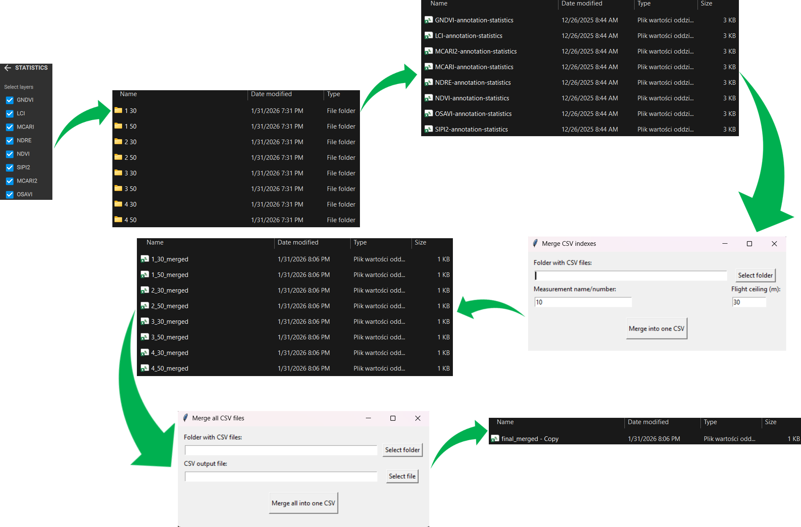

### `Data pre-processing and analysis of the results obtained in Pix4Dfields`
This repository contains all preprocessing and evaluation code used in the study 
“Effects of Cane Density on Primocane Raspberry Assessed Us-ing UAV-Based Multispectral Imaging”.

## Citation
If you use this repository, please cite:
Will be added after publication

Multispectral imaging enables the acquisition of extensive datasets that require advanced analytical processing. 
Pix4Dfields software allows the computation of vegetation indices for user-defined areas, along with their 
corresponding standard deviations, which are essential for further analyses. Nevertheless, although this process 
condenses raw imagery into interpretable metrics, it produces a substantial volume of results whose proper 
interpretation is critical, especially in long-term studies.

  

